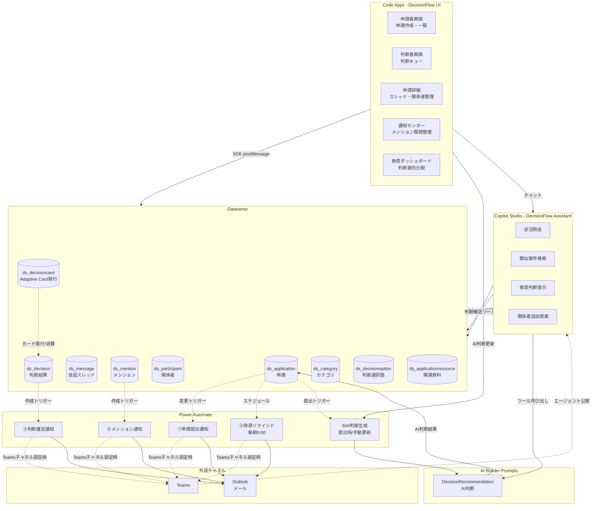
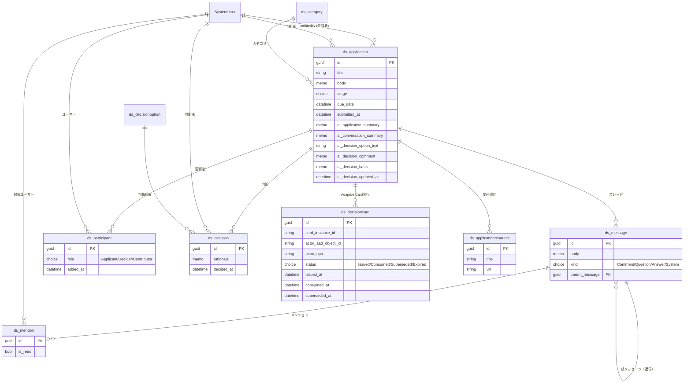
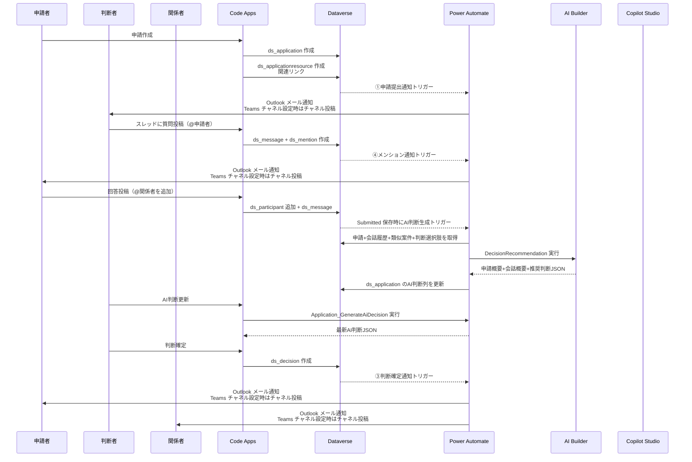
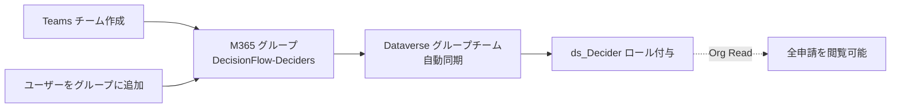

# DecisionFlow アーキテクチャ

> **最終更新**: 2026-05-04

---

## 1. コンポーネント構成

### 1.1 採用コンポーネント

| コンポーネント                 | 役割                                         | 採用理由                                                       |
| ------------------------------ | -------------------------------------------- | -------------------------------------------------------------- |
| **Dataverse**                  | 申請・会話・判断・関係者・カテゴリの一元管理 | リレーショナル / 行レベルセキュリティ / 監査が必須             |
| **Code Apps**                  | 申請者UI / 判断者UI / 経営ダッシュボード     | 判断キュー・スレッドUI・負荷チャート等カスタムビジュアルが必要 |
| **Power Automate**             | イベント駆動の通知・リマインド・AI 判断生成  | 確定的フロー処理                                               |
| **Copilot Studio**             | DecisionFlow Assistant                       | 判断待ち一覧 / 申請概要 / 類似案件 / 判断ドラフト              |
| **AI Builder (AI プロンプト)** | `DecisionRecommendation` による AI 判断生成  | フローから再利用 + 構造化 JSON 出力                            |

### 1.2 全体アーキテクチャ



---

## 2. データモデル

### 2.1 ER 図



### 2.2 テーブル定義（概要）

| スキーマ名               | 表示名           | 種別   | 主要列                                                                                                                                                |
| ------------------------ | ---------------- | ------ | ----------------------------------------------------------------------------------------------------------------------------------------------------- |
| `ds_application`         | 申請             | 主     | タイトル, 本文(Memo), カテゴリ(Lookup), 判断者(Lookup→SystemUser), ステージ(Choice), 希望期限, 提出日, AI申請概要, AI会話概要, AI推奨判断, AIコメント |
| `ds_message`             | メッセージ       | 従属   | 申請(Lookup), 本文(Memo), 種別(Choice), 親メッセージ(Lookup→self)                                                                                     |
| `ds_mention`             | メンション       | 従属   | メッセージ(Lookup), 対象ユーザー(Lookup→SystemUser), 既読フラグ(Yes/No)                                                                               |
| `ds_participant`         | 関係者           | 従属   | 申請(Lookup), ユーザー(Lookup→SystemUser), 役割(Choice), 追加者(Lookup→SystemUser), 追加日時                                                          |
| `ds_decision`            | 判断             | 従属   | 申請(Lookup), 判断者(Lookup→SystemUser), 判断結果(Lookup→`ds_decisionoption`), 理由(Memo), 確定日時                                                   |
| `ds_decisioncard`        | 判断カード発行   | 従属   | 申請(Lookup), cardInstanceId, actor AAD, actor UPN, 状態, 発行/消費/失効日時                                                                          |
| `ds_applicationresource` | 関連資料         | 従属   | 申請(Lookup), タイトル, URL, 説明(Memo)                                                                                                               |
| `ds_category`            | カテゴリ         | マスタ | 名称, 説明, 推奨フォーマット(Memo)                                                                                                                    |
| `ds_decisionoption`      | 判断選択肢       | マスタ | 名称, 説明, 並び順                                                                                                                                    |
| `SystemUser`             | システムユーザー | 標準   | （申請者 = `createdby` で取得、判断者・関係者は Lookup）                                                                                              |

### 2.3 列定義

| テーブル                 | 列論理名                   | 表示名           | 型           | 備考                                                  |
| ------------------------ | -------------------------- | ---------------- | ------------ | ----------------------------------------------------- |
| `ds_category`            | `ds_name`                  | カテゴリ名       | String       | 主列                                                  |
| `ds_category`            | `ds_description`           | 説明             | Memo         | 任意                                                  |
| `ds_category`            | `ds_template`              | 推奨フォーマット | Memo         | 申請入力支援用                                        |
| `ds_category`            | `ds_sortorder`             | 並び順           | Integer      | 一覧表示順                                            |
| `ds_decisionoption`      | `ds_name`                  | 判断名           | String       | 主列                                                  |
| `ds_decisionoption`      | `ds_description`           | 説明             | Memo         | 任意                                                  |
| `ds_decisionoption`      | `ds_sortorder`             | 並び順           | Integer      | 一覧表示順                                            |
| `ds_application`         | `ds_name`                  | タイトル         | String       | 主列                                                  |
| `ds_application`         | `ds_body`                  | 申請本文         | Memo         | 申請内容                                              |
| `ds_application`         | `ds_stage`                 | ステージ         | Choice       | Draft / Submitted / Decided                           |
| `ds_application`         | `ds_duedate`               | 希望期限         | DateOnly     | 任意                                                  |
| `ds_application`         | `ds_submittedat`           | 提出日時         | DateAndTime  | 任意                                                  |
| `ds_application`         | `ds_aiapplicationsummary`  | AI申請概要       | Memo         | AI 判断生成時の申請概要                               |
| `ds_application`         | `ds_aiconversationsummary` | AI会話概要       | Memo         | AI 判断生成時の会話概要。会話がない場合もその旨を保存 |
| `ds_application`         | `ds_aidecisionoptiontext`  | AI推奨判断       | String       | AI が推奨した判断選択肢名                             |
| `ds_application`         | `ds_aidecisioncomment`     | AI判断コメント   | Memo         | 判断コメントのたたき台                                |
| `ds_application`         | `ds_aidecisionbasis`       | AI判断根拠       | Memo         | リスク・類似案件などの補足 JSON またはテキスト        |
| `ds_application`         | `ds_aidecisionupdatedat`   | AI判断更新日時   | DateAndTime  | 任意                                                  |
| `ds_message`             | `ds_name`                  | 件名             | String       | 主列（短い要約）                                      |
| `ds_message`             | `ds_body`                  | 本文             | Memo         | 会話本文                                              |
| `ds_message`             | `ds_kind`                  | 種別             | Choice       | Comment / Question / Answer / System                  |
| `ds_mention`             | `ds_name`                  | 件名             | String       | 主列                                                  |
| `ds_mention`             | `ds_isread`                | 既読             | Boolean      | 初期値 false                                          |
| `ds_participant`         | `ds_name`                  | 件名             | String       | 主列                                                  |
| `ds_participant`         | `ds_role`                  | 役割             | Choice       | Applicant / Decider / Contributor                     |
| `ds_participant`         | `ds_addedat`               | 追加日時         | DateAndTime  | 任意                                                  |
| `ds_decision`            | `ds_name`                  | 件名             | String       | 主列                                                  |
| `ds_decision`            | `ds_rationale`             | 判断理由         | Memo         | 必須運用                                              |
| `ds_decision`            | `ds_decidedat`             | 判断日時         | DateAndTime  | 任意                                                  |
| `ds_applicationresource` | `ds_name`                  | タイトル         | String       | 主列                                                  |
| `ds_applicationresource` | `ds_url`                   | URL              | String(1000) | Link 用                                               |
| `ds_applicationresource` | `ds_description`           | 説明             | Memo         | 任意                                                  |

> 過去設計で作成した `ds_type` / `ds_attachment` / `ds_status` / `ds_version` / `ds_replacedat` / `ds_replacedfromid` は廃止対象。既存環境では [scripts/migrate_cleanup_obsolete_metadata.py](../scripts/migrate_cleanup_obsolete_metadata.py) で削除済み。旧 AI 要約計画で作成した `ds_aisummary` / `ds_summaryupdatedat` / `ds_message.kind=AISummary` も [scripts/migrate_cleanup_old_ai_summary.py](../scripts/migrate_cleanup_old_ai_summary.py) で削除済み。

### 2.4 Lookup リレーション

| From                     | To                  | Lookup 列論理名       | 表示名       |
| ------------------------ | ------------------- | --------------------- | ------------ |
| `ds_application`         | `ds_category`       | `ds_categoryid`       | カテゴリ     |
| `ds_application`         | `systemuser`        | `ds_deciderid`        | 判断者       |
| `ds_message`             | `ds_application`    | `ds_applicationid`    | 申請         |
| `ds_message`             | `ds_message`        | `ds_parentmessageid`  | 親メッセージ |
| `ds_mention`             | `ds_message`        | `ds_messageid`        | メッセージ   |
| `ds_mention`             | `systemuser`        | `ds_targetuserid`     | 対象ユーザー |
| `ds_participant`         | `ds_application`    | `ds_applicationid`    | 申請         |
| `ds_participant`         | `systemuser`        | `ds_userid`           | ユーザー     |
| `ds_participant`         | `systemuser`        | `ds_addedbyid`        | 追加者       |
| `ds_decision`            | `ds_application`    | `ds_applicationid`    | 申請         |
| `ds_decision`            | `systemuser`        | `ds_deciderid`        | 判断者       |
| `ds_decision`            | `ds_decisionoption` | `ds_decisionoptionid` | 判断結果     |
| `ds_decisioncard`        | `ds_application`    | `ds_applicationid`    | 申請         |
| `ds_applicationresource` | `ds_application`    | `ds_applicationid`    | 申請         |

### 2.5 Choice 値定義

**ステージ** (`ds_application.stage`):

| 値        | 名称      | 説明     |
| --------- | --------- | -------- |
| 100000000 | Draft     | 下書き   |
| 100000001 | Submitted | 提出済み |
| 100000004 | Decided   | 判断済み |

**役割** (`ds_participant.role`):

| 値        | 名称        | 説明                                               |
| --------- | ----------- | -------------------------------------------------- |
| 100000000 | Applicant   | 申請者（申請作成時に自動設定）                     |
| 100000001 | Decider     | 判断者（申請作成・編集時に自動設定）               |
| 100000003 | Contributor | 関係者（関係者タブから追加。役割選択UIなしで固定） |

> 旧設計の `CoDecider` (100000002) と `Observer` (100000004) は廃止。`scripts/migrate_remove_unused_roles.py` で削除済み。既存レコードがあれば Contributor に変換される。

**メッセージ種別** (`ds_message.kind`):

| 値        | 名称     | 説明                         |
| --------- | -------- | ---------------------------- |
| 100000000 | Comment  | 通常コメント                 |
| 100000001 | Question | 質問                         |
| 100000002 | Answer   | 回答                         |
| 100000003 | System   | システム投稿（参加者追加等） |

**判断カード状態** (`ds_decisioncard.status`):

| 値        | 名称       | 説明                               |
| --------- | ---------- | ---------------------------------- |
| 100000000 | Issued     | 最新の未使用カード                 |
| 100000001 | Consumed   | submit 成功後に消費済み            |
| 100000002 | Superseded | 再発行により無効化されたカード     |
| 100000003 | Expired    | 有効期限切れとして無効化したカード |

### 2.6 マスタ初期値

**カテゴリ** (`ds_category`): 顧客案件 / 部内案件 / 課内案件 / 他部署案件 / 事務処理

**判断選択肢** (`ds_decisionoption`): 承認 / 却下 / 差し戻し

---

## 3. UI 設計（Code Apps）

### 3.1 画面構成

| #   | 画面               | ロール       | 主要機能                                                                |
| --- | ------------------ | ------------ | ----------------------------------------------------------------------- |
| 1   | 申請リスト         | 申請者       | 自分が起票した申請を作成・確認                                          |
| 2   | 申請作成・編集     | 申請者       | カテゴリ選択でフォーマット切替、AI による論点補完、関連リンク登録       |
| 3   | 判断キュー         | 判断者       | 自分が判断者の申請を確認                                                |
| 4   | 申請詳細           | 両者         | 申請本文、関連資料、スレッドビュー、関係者一覧、判断記入、AI 判断カード |
| 5   | 通知センター       | 全員         | 自分宛メンション一覧（既読/未読切替）                                   |
| 6   | 負荷ダッシュボード | 管理者・経営 | 判断者別の保有件数・平均判断日数・停滞件数                              |

### 3.2 申請詳細画面の主要要素

- **申請本文パネル**: タイトル、カテゴリ、希望期限、ステージ、判断者
- **関連資料パネル**: 関連リンクの追加、表示、確認付き削除
- **AI 判断カード**: 判断タブ右側に申請概要、会話概要、推奨判断、コメント、リスク、類似案件、「AI判断更新」ボタンを表示
- **スレッドビュー**: 時系列・ネスト返信、メンション補完（@user）
- **メンション作成**: コメント投稿時に申請者・判断者・関係者から対象ユーザーを任意選択し、`ds_message` 作成後に `ds_mention` を作成する
- **関係者パネル**: 役割別リスト、追加ボタン（権限者のみ）
- **判断タブ**: 最新判断結果と理由の表示。未判断かつログインユーザーが判断者でステージが提出済みの場合のみ、判断選択肢、理由入力（必須）、確定ボタンを表示

### 3.3 ステージ操作ルール

- ステージ操作の主体は申請者とする。
- 申請者が申請作成・編集フォームで選べるステージは `Draft`（下書き）と `Submitted`（提出済み）のみ。
- フォームではラジオボタンでステージを選択し、初期値は `Draft` とする。
- `Submitted`（提出済み）になった申請は、通知重複を避けるため通常編集を禁止する。申請者本人が変更できるのは `Draft`（下書き）へ戻す操作だけとする。
- `Decided`（判断済み）は `ds_decision` 作成後に `Decision_OnCreated` が自動設定する。ただし判断選択肢が「差し戻し」の場合は、申請者が修正できるよう `Draft`（下書き）へ戻し、`ds_submittedat` をクリアする。
- 差し戻し後に再提出された申請は、過去の `ds_decision` を残したまま新しい判断を追加できる。判断入力フォームの表示可否は最新判断の有無ではなく、現在ステージが `Submitted` かつログインユーザーが判断者かで判定する。
- 判断タブの入力フォームは、設定された判断者本人かつ `Submitted`（提出済み）の申請にのみ表示する。
- 取り下げ専用ステージは持たず、不要な申請は確認モーダル付きの申請削除で扱う。

### 3.4 関連資料リンクルール

- 申請者は下書き中および提出後も、権限がある申請に対して関連リンクを追加できる
- 関連資料はリンクのみを扱い、ファイル添付・種別・ステータスは Code Apps の操作対象外とする
- 不要な関連リンクは確認モーダルを経由して削除する

### 3.5 技術スタック

- TypeScript + React + Vite
- Tailwind CSS + shadcn/ui
- TanStack React Query
- Power Apps Code SDK（Dataverse 接続）

---

## 4. Power Automate フロー

### 4.1 フロー一覧

| フロー名                             | 目的                                           | トリガー                                                                  |
| ------------------------------------ | ---------------------------------------------- | ------------------------------------------------------------------------- |
| `Participant_OnCreated_GrantAccess`  | 関係者追加時に対象申請を共有する               | Dataverse: `ds_participant` 行追加                                        |
| `Participant_PreDelete_RevokeAccess` | 関係者削除前に対象申請の共有を外す             | Power Apps V2: Code Apps から申請 ID・ユーザー ID・関係者 ID を渡して起動 |
| `Application_OnSubmitted`            | 申請提出時に判断者・関係者へ通知する           | Dataverse: `ds_application` 行変更                                        |
| `Decision_OnCreated`                 | 判断確定時にステージ整合・通知する             | Dataverse: `ds_decision` 行追加                                           |
| `Mention_OnCreated`                  | メンション対象ユーザーへ通知する               | Dataverse: `ds_mention` 行追加                                            |
| `Application_StalledReminder`        | 期限超過または停滞申請を判断者へリマインドする | Recurrence: 毎朝 9:00 JST                                                 |
| `Application_GenerateAiDecision`     | 申請の AI 判断を生成・更新する                 | Power Apps V2: Code Apps の Submitted 保存時 / 「AI判断更新」ボタン       |

### 4.2 フロー設計詳細

<!-- markdownlint-disable MD060 -->

| フロー名                             | 主な条件                                                                                                | 主なアクション                                                                                                                                                                                                                                     | 必要な接続                                     |
| ------------------------------------ | ------------------------------------------------------------------------------------------------------- | -------------------------------------------------------------------------------------------------------------------------------------------------------------------------------------------------------------------------------------------------- | ---------------------------------------------- |
| `Participant_OnCreated_GrantAccess`  | `_ds_applicationid_value` と `_ds_userid_value` がある                                                  | Dataverse `PerformUnboundAction` で `Target` に対象 `ds_application` を渡し、`GrantAccess` を実行する。権限は `ReadAccess` + `AppendToAccess`                                                                                                      | Dataverse                                      |
| `Participant_PreDelete_RevokeAccess` | 申請 ID とユーザー ID がある。`RevokeAccess` 成功後に Code Apps が `ds_participant` を削除する          | Dataverse `PerformUnboundAction` で `Target` に対象 `ds_application` を渡し、`RevokeAccess` を実行する。成功/失敗を Code Apps に返す                                                                                                               | Dataverse                                      |
| `Application_OnSubmitted`            | `ds_stage` が Submitted                                                                                 | 判断者と関係者を取得し、Outlook メール通知。Teams チャネル設定がある場合はチャネルにも投稿                                                                                                                                                         | Dataverse, Microsoft Teams, Office 365 Outlook |
| `Decision_OnCreated`                 | 申請 Lookup がある                                                                                      | 申請、判断者、判断選択肢、関係者を取得する。判断選択肢から次ステージを導出し、`ds_application.ds_stage` を更新する。`差し戻し` の場合だけ `ds_submittedat` をクリアする。その後 Outlook メール通知。Teams チャネル設定がある場合はチャネルにも投稿 | Dataverse, Microsoft Teams, Office 365 Outlook |
| `Mention_OnCreated`                  | 対象ユーザー Lookup がある、`ds_isread` が false                                                        | メッセージと申請を取得し、対象ユーザーへ Outlook メール通知。Teams チャネル設定がある場合はチャネルにも投稿                                                                                                                                        | Dataverse, Microsoft Teams, Office 365 Outlook |
| `Application_StalledReminder`        | `ds_stage` が Submitted、希望期限超過または `ds_submittedat` から 3 日以上経過。`modifiedon` は使わない | 対象申請ごとに判断者を取得し、Outlook メールで通知。Teams チャネル設定がある場合はチャネルにも投稿                                                                                                                                                 | Dataverse, Office 365 Outlook, Microsoft Teams |
| `Application_GenerateAiDecision`     | 対象申請が Submitted。提出直後は会話履歴が空でもよい。類似過去案件は初回提出時から検索対象にする。      | 申請、関連資料、会話履歴、過去類似案件、判断選択肢を取得し、AI Builder `DecisionRecommendation` を実行。申請概要・会話概要・推奨判断・コメント・根拠を `ds_application` に保存し、Code Apps 呼び出し時は結果を返す。                               | Dataverse, AI Builder                          |

<!-- markdownlint-enable MD060 -->

補足: `Application_OnSubmitted` は Dataverse トリガーの `subscriptionRequest/message: 4`（Create or Update）を使う。これにより、新規作成時点で Submitted の申請と、既存申請が Submitted に更新されたケースを 1 本のフローで扱う。

### 4.3 アクセス制御フローの詳細

`Participant_OnCreated_GrantAccess` は、`ds_participant` が作成されたタイミングで対象ユーザーに申請レコードを共有する。

付与するアクセス権:

- `ReadAccess`: 参加した申請を閲覧するため
- `AppendToAccess`: 共有された申請を Lookup 先としてメッセージや関連リンクなどの従属レコードを作成できるようにするため

`Participant_PreDelete_RevokeAccess` は、関係者削除前に Code Apps から明示的に呼び出す。

削除前 revoke の処理順:

1. Code Apps が削除対象の `ds_participantid`、`ds_applicationid`、`systemuserid` を保持する
2. Code Apps が Power Apps V2 トリガーの `Participant_PreDelete_RevokeAccess` を呼び出す
3. フローが対象 `ds_application` に `RevokeAccess` を実行する
4. フローが成功/失敗を Code Apps に返す
5. 成功時のみ Code Apps が `ds_participant` を削除する
6. 失敗時は関係者レコードを残し、ユーザーにエラーを表示する

### 4.4 通知フローの本文方針

通知は Outlook メールを標準とし、Teams は `.env` にチャネル ID が設定されている場合だけチャネル投稿を追加する。

通知に含める情報:

- 申請タイトル
- ステージまたはイベント種別
- 判断者またはメンション対象者
- 希望期限
- 申請詳細へのリンク
- 次に取るべき行動

### 4.5 AI 判断生成の起動条件

- Code Apps で申請が Submitted になった保存時点で自動実行する。
- Code Apps の判断タブにある「AI判断更新」ボタンから手動再実行できる。
- 初回提出時は会話履歴が空でも実行し、過去類似案件は初回提出時から検索対象にする。
- 過去案件候補はトークン消費を抑えるため、同一カテゴリの判断済み案件を最大 30 件、補助候補として直近判断済み案件を最大 10 件に制限する。
- 会話ログが一定数たまったら要約する自動要約バッチは実装しない。

### 4.6 必要な接続（事前作成）

Phase 2.5 実装前に、対象環境で以下の接続を Power Automate UI から作成しておく。API で接続の自動作成は行わない。

- Dataverse
- Microsoft Teams
- Office 365 Outlook
- AI Builder（`Application_GenerateAiDecision` 実装時）

---

## 5. AI Builder プロンプト

| プロンプト                           | 入力                                                       | 出力 (JSON)                                                                                  |
| ------------------------------------ | ---------------------------------------------------------- | -------------------------------------------------------------------------------------------- |
| **DecisionRecommendation**（AI判断） | 申請 + 関連資料一覧 + 会話履歴 + 過去類似案件 + 判断選択肢 | `{applicationSummary, conversationSummary, recommendedOption, comment, risks, similarCases}` |

`IssueExtraction`（論点抽出）は将来候補。2026-05-03 時点では作成・デプロイしていない。

`DecisionRecommendation` の出力例:

```json
{
  "applicationSummary": "申請の目的、背景、依頼内容を判断者向けに3〜5文で要約する。",
  "conversationSummary": "会話履歴がある場合は論点、追加確認、合意事項を要約する。会話履歴がない場合は『提出時点では会話履歴はありません。』と返す。",
  "recommendedOption": "承認",
  "comment": "推奨判断の理由を、判断者がそのまま判断コメントのたたき台にできる粒度で記述する。",
  "risks": ["追加確認が必要なリスクや前提条件"],
  "similarCases": [
    {
      "title": "過去類似案件名",
      "decision": "承認",
      "reason": "今回の申請と類似している点"
    }
  ]
}
```

---

## 6. Copilot Studio エージェント

### 6.1 エージェント仕様

| 項目       | 値                              |
| ---------- | ------------------------------- |
| 名前       | DecisionFlow Assistant          |
| スキーマ名 | `ds_DecisionFlowAssistant`      |
| モード     | 生成オーケストレーション        |
| 公開先     | Teams / Microsoft 365 Copilot   |
| 認証       | Microsoft Entra ID ユーザー認証 |

### 6.2 主要なユースケース

| ユーザー発話例                     | エージェントの動作                                         |
| ---------------------------------- | ---------------------------------------------------------- |
| 「判断待ちの申請を教えて」         | 提出済み申請を利用者の参照可能範囲で一覧表示               |
| 「この申請の概要を教えて」         | 申請本文・AI申請概要・会話履歴から背景、目的、論点を要約   |
| 「関連資料リンクを教えて」         | `ds_applicationresource` のリンクを一覧表示                |
| 「過去の類似案件は？」             | 過去の判断済み申請と判断理由を検索し、共通点・相違点を提示 |
| 「判断コメントのドラフトを作って」 | 推奨判断、根拠、リスク、判断コメント案を生成               |
| 申請情報が不足している             | Code Apps の申請リンクまたは申請タイトルの貼り付けを促す   |

### 6.3 ツール構成

- **ナレッジ**: Dataverse `ds_application` / `ds_message` / `ds_applicationresource` / `ds_decision` / `ds_decisionoption`
- **判断確定ツール**: Generative Orchestration は維持し、判断確定カードの表示・submit 受信だけ専用 Adaptive Card Topic で扱う。Power Automate agent flow は `issue_decision_card` と `confirm_decision` を提供する。
- **カード責務**: Adaptive Card JSON は Copilot Studio 側に保持し、schema 1.5 と `Action.Submit` のみを使う。Power Automate はカード表示 JSON を所有しない。
- **正本イベント**: Copilot Studio のカード処理は `ds_decision` を作成し、`ds_application` を直接更新しない。案件ステージ・通知は `Decision_OnCreated` に委譲する。
- **通知連携**: `Application_OnSubmitted` / `Application_StalledReminder` の Outlook メールに、Teams エージェント会話へのディープリンクを追加可能。有効化には `.env` に `COPILOT_TEAMS_APP_ID` を設定する。

---

## 7. シーケンス図



---

## 8. セキュリティ

### 8.1 設計方針: ロール × テーブルのハイブリッド

- **セキュリティロール** = 「職位」を表す権限（全体閲覧権の付与）
- **`ds_participant` テーブル** = 「個別案件の参加者」を表すデータ（通知対象・案件単位の役割）

### 8.2 セキュリティロール定義

- `ds_Applicant`（申請者）: 全社員に付与。`ds_application` は User: Read/Create/Write/Delete（自分の申請のみ）、`ds_message` は User: Read/Create、`ds_decision` はなし、`ds_participant` は User: Read。
- `ds_Decider`（判断者）: DecisionFlow-Deciders グループのメンバーに付与。`ds_application` は Organization: Read（全申請閲覧可）、`ds_message` は Organization: Read、`ds_decision` は User: Create/Write/Read、`ds_participant` は Organization: Read。
- `ds_Admin`（管理者）: 経営・管理者に付与。`ds_application`、`ds_message`、`ds_decision`、`ds_participant` は Organization: 全権限。

`ds_applicationresource` は申請に紐づく根拠資料のため、`ds_application` と同等の閲覧範囲を適用する。

### 8.3 判断者の管理: M365 グループ + Dataverse グループチーム



**運用手順**:

1. Teams で「DecisionFlow-Deciders」チームを作成（M365 グループが自動生成）
2. Power Apps 管理センターで Dataverse グループチームを作成し、当該 M365 グループと紐付け（メンバーシップ種別: Members and guests）
3. グループチームに `ds_Decider` ロールを付与
4. 以降、Teams にメンバー追加するだけで判断者権限が付与される

### 8.4 申請者の閲覧範囲

- 申請者は **自分の申請のみ閲覧可能**（他者の過去申請は見えない）
- メンションされた / 関係者に追加された場合のみ、当該申請を閲覧可能
  - Power Automate で対象ユーザーに **`Share` API**（GrantAccess）で当該申請レコードへの Read 権を付与
  - `ds_application` から子テーブル（`ds_participant`, `ds_message`, `ds_decision`, `ds_applicationresource`）への リレーションは Cascade Share が設定されており、申請の共有時に既存子レコードも自動的に共有される（`scripts/migrate_cascade_share.py` で適用）
  - 関係者削除時は、Code Apps が削除前に Power Automate を呼び出して `Share` を Revoke し、成功後に `ds_participant` を削除

### 8.5 関係者参加と通知

- 申請者・判断者は申請作成時に自動で `ds_participant` に登録（それぞれ Applicant / Decider ロール）
- メンションだけでは `ds_participant` への自動追加や `Share` 付与は行わない
- 関係者として閲覧権を付与する場合は、申請詳細の関係者追加操作で `ds_participant` を Contributor ロールで作成し、`Participant_OnCreated_GrantAccess` で対象申請を共有する
- 関係者追加時は `addParticipantWithMention` メソッドが System メッセージと Mention を作成し、追加対象者に通知する。Mention の `ownerid` は target ユーザーに設定され、本人が既読化できるようにしている
- マスタ管理（`ds_category`, `ds_decisionoption` の編集）は `ds_Admin` ロール保持者のみ。サイドバー表示と `/masters` ルートガードで二重に制御。Dataverse レベルでも非 Admin は Read+AppendTo のみ

### 8.6 別テナントへのソリューション移送

| 項目                              | ソリューション移送 | 備考                                             |
| --------------------------------- | ------------------ | ------------------------------------------------ |
| セキュリティロール定義            | ✅                 | 権限マトリクスごと移送される                     |
| テーブル・列・リレーション        | ✅                 | 標準                                             |
| Code Apps / フロー / エージェント | ✅                 | 標準                                             |
| 接続参照（Connection Reference）  | ✅ 定義のみ        | 接続実体は移送先で再作成                         |
| 環境変数（Environment Variables） | ✅                 | 値は移送先で上書き（環境固有値はここに切り出す） |
| ロールとユーザーの紐付け          | ❌                 | テナント固有のユーザー ID。再割当が必要          |
| Dataverse グループチーム          | ❌                 | M365 グループ Object ID がテナント固有           |
| M365 グループ自体                 | ❌                 | Dataverse 管理外。Graph API or Teams で別途作成  |
| Share API による行レベル付与      | ❌                 | データ層のため対象外                             |

**移送手順（推奨）**:

1. 開発テナントから **Managed Solution** でエクスポート
2. 本番テナントにインポート
3. M365 グループ `DecisionFlow-Deciders` を新テナントで作成（Teams UI 推奨）
4. Power Platform 管理センターで Dataverse グループチームを手動作成し、`DecisionFlow-Deciders` に紐付ける
5. 作成した Dataverse グループチームに `ds_Decider` ロールを手動付与する
6. Power Automate 接続を再作成（Dataverse / Outlook / Teams）
7. Code Apps の `power.config.json` を `npx power-apps init` で再生成
8. Copilot Studio の公開先（Teams チャネル等）を再設定
