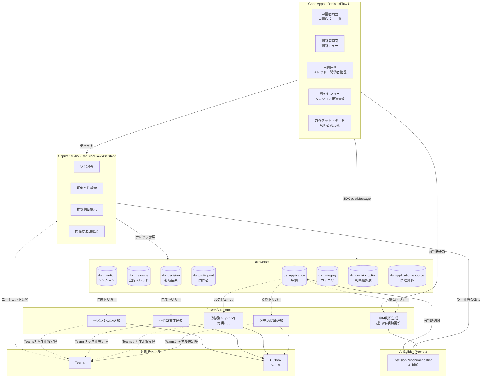
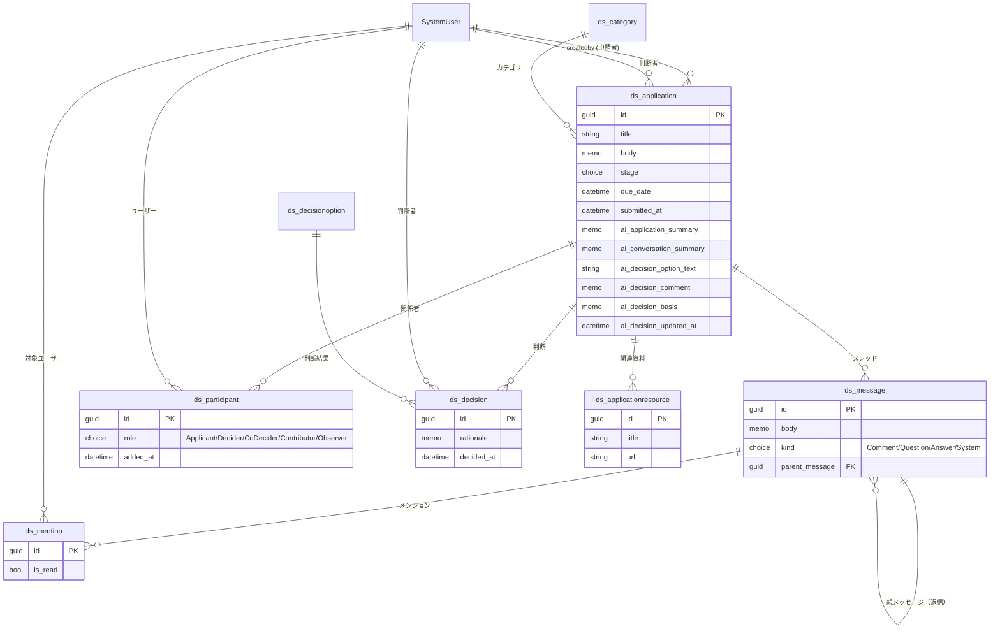
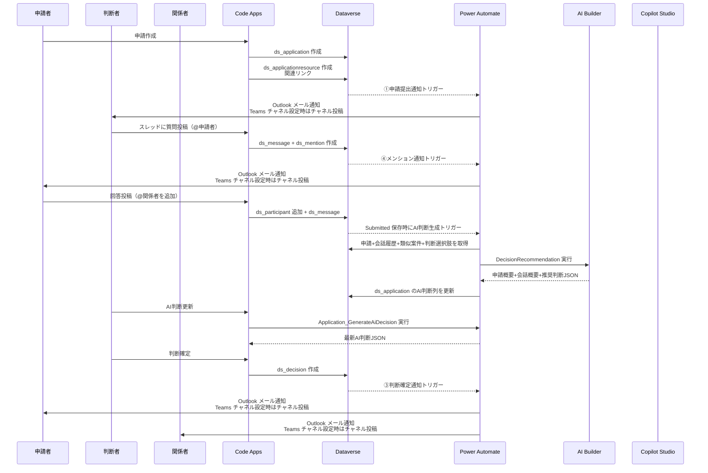
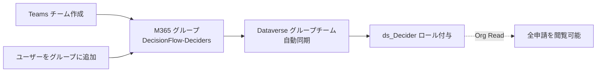

# DecisionFlow 設計ドラフト

> **ステータス**: IMPLEMENTATION（Phase 2.5 アクセス制御・通知/リマインドフロー実装済み / AI 判断デプロイ済み）
> **最終更新**: 2026-05-03
> **次フェーズ**: Power Apps 実機確認 → 通知/リマインド配信の実機確認 → AI 判断生成の実機確認

---

## 1. プロジェクト概要

### 1.1 背景・課題

申請者が判断者に意思決定を依頼するプロセスにおいて、以下の課題がある:

- **申請者**: 入力負荷が大きい / 案件が停滞しても気づけない / 判断理由が不透明
- **判断者**: 申請フォーマットがバラバラで読みにくい / 過去判断との一貫性が取りにくい / 案件が属人化し負荷が偏る / 全件を熟読する時間がない
- **両者共通**: 関係者を巻き込んだ会話が散在し、後から追えない

### 1.2 ゴール

意思決定を **迅速・的確・納得感のある** プロセスにする統合プラットフォーム **「DecisionFlow」** を構築する。

| ステークホルダー | メリット                                                                             |
| ---------------- | ------------------------------------------------------------------------------------ |
| 申請者           | 停滞日数の可視化 / 自動フォロー / 判断理由の明確化                                   |
| 判断者           | フォーマット化された申請 / 過去履歴の参照 / 負荷平準化 / AI による論点要約と推奨判断 |
| 関係者           | 必要な議論にだけ参加 / メンション通知で見逃さない                                    |
| 経営・管理者     | 判断者別の負荷比較 / 意思決定スループット可視化                                      |

### 1.3 システム名

| 項目                         | 値                              |
| ---------------------------- | ------------------------------- |
| プロダクト名                 | DecisionFlow                    |
| ソリューション表示名         | 意思決定支援 (Decision Support) |
| ソリューション一意名         | `DecisionSupport`               |
| パブリッシャープレフィックス | `ds`                            |

---

## 2. コンポーネント構成

### 2.1 採用コンポーネント

| コンポーネント                 | 役割                                         | 採用理由                                                       |
| ------------------------------ | -------------------------------------------- | -------------------------------------------------------------- |
| **Dataverse**                  | 申請・会話・判断・関係者・カテゴリの一元管理 | リレーショナル / 行レベルセキュリティ / 監査が必須             |
| **Code Apps**                  | 申請者UI / 判断者UI / 経営ダッシュボード     | 判断キュー・スレッドUI・負荷チャート等カスタムビジュアルが必要 |
| **Power Automate**             | イベント駆動の通知・リマインド・AI 判断生成  | 確定的フロー処理                                               |
| **Copilot Studio**             | DecisionFlow Assistant（Phase 3 予定）       | LLM 推論 / ナレッジ検索 / 自然言語対話                         |
| **AI Builder (AI プロンプト)** | `DecisionRecommendation` による AI 判断生成  | フローから再利用 + 構造化 JSON 出力                            |

### 2.2 全体アーキテクチャ



---

## 3. データモデル

### 3.1 ER 図



### 3.2 テーブル定義（概要）

| スキーマ名               | 表示名           | 種別   | 主要列                                                                                                                                                |
| ------------------------ | ---------------- | ------ | ----------------------------------------------------------------------------------------------------------------------------------------------------- |
| `ds_application`         | 申請             | 主     | タイトル, 本文(Memo), カテゴリ(Lookup), 判断者(Lookup→SystemUser), ステージ(Choice), 希望期限, 提出日, AI申請概要, AI会話概要, AI推奨判断, AIコメント |
| `ds_message`             | メッセージ       | 従属   | 申請(Lookup), 本文(Memo), 種別(Choice), 親メッセージ(Lookup→self)                                                                                     |
| `ds_mention`             | メンション       | 従属   | メッセージ(Lookup), 対象ユーザー(Lookup→SystemUser), 既読フラグ(Yes/No)                                                                               |
| `ds_participant`         | 関係者           | 従属   | 申請(Lookup), ユーザー(Lookup→SystemUser), 役割(Choice), 追加者(Lookup→SystemUser), 追加日時                                                          |
| `ds_decision`            | 判断             | 従属   | 申請(Lookup), 判断者(Lookup→SystemUser), 判断結果(Lookup→`ds_decisionoption`), 理由(Memo), 確定日時                                                   |
| `ds_applicationresource` | 関連資料         | 従属   | 申請(Lookup), タイトル, URL, 説明(Memo)                                                                                                               |
| `ds_category`            | カテゴリ         | マスタ | 名称, 説明, 推奨フォーマット(Memo)                                                                                                                    |
| `ds_decisionoption`      | 判断選択肢       | マスタ | 名称, 説明, 並び順                                                                                                                                    |
| `SystemUser`             | システムユーザー | 標準   | （申請者 = `createdby` で取得、判断者・関係者は Lookup）                                                                                              |

### 3.2.1 列定義（Phase 1 実装対象）

| テーブル                 | 列論理名                   | 表示名           | 型           | 備考                                                     |
| ------------------------ | -------------------------- | ---------------- | ------------ | -------------------------------------------------------- |
| `ds_category`            | `ds_name`                  | カテゴリ名       | String       | 主列                                                     |
| `ds_category`            | `ds_description`           | 説明             | Memo         | 任意                                                     |
| `ds_category`            | `ds_template`              | 推奨フォーマット | Memo         | 申請入力支援用                                           |
| `ds_category`            | `ds_sortorder`             | 並び順           | Integer      | 一覧表示順                                               |
| `ds_decisionoption`      | `ds_name`                  | 判断名           | String       | 主列                                                     |
| `ds_decisionoption`      | `ds_description`           | 説明             | Memo         | 任意                                                     |
| `ds_decisionoption`      | `ds_sortorder`             | 並び順           | Integer      | 一覧表示順                                               |
| `ds_application`         | `ds_name`                  | タイトル         | String       | 主列                                                     |
| `ds_application`         | `ds_body`                  | 申請本文         | Memo         | 申請内容                                                 |
| `ds_application`         | `ds_stage`                 | ステージ         | Choice       | Draft / Submitted / Decided                              |
| `ds_application`         | `ds_duedate`               | 希望期限         | DateOnly     | 任意                                                     |
| `ds_application`         | `ds_submittedat`           | 提出日時         | DateAndTime  | 任意                                                     |
| `ds_application`         | `ds_aiapplicationsummary`  | AI申請概要       | Memo         | AI 判断生成時の申請概要                                  |
| `ds_application`         | `ds_aiconversationsummary` | AI会話概要       | Memo         | AI 判断生成時の会話概要。会話がない場合もその旨を保存    |
| `ds_application`         | `ds_aidecisionoptiontext`  | AI推奨判断       | String       | AI が推奨した判断選択肢名                                |
| `ds_application`         | `ds_aidecisioncomment`     | AI判断コメント   | Memo         | 判断コメントのたたき台                                   |
| `ds_application`         | `ds_aidecisionbasis`       | AI判断根拠       | Memo         | リスク・類似案件などの補足 JSON またはテキスト           |
| `ds_application`         | `ds_aidecisionupdatedat`   | AI判断更新日時   | DateAndTime  | 任意                                                     |
| `ds_message`             | `ds_name`                  | 件名             | String       | 主列（短い要約）                                         |
| `ds_message`             | `ds_body`                  | 本文             | Memo         | 会話本文                                                 |
| `ds_message`             | `ds_kind`                  | 種別             | Choice       | Comment / Question / Answer / System                     |
| `ds_mention`             | `ds_name`                  | 件名             | String       | 主列                                                     |
| `ds_mention`             | `ds_isread`                | 既読             | Boolean      | 初期値 false                                             |
| `ds_participant`         | `ds_name`                  | 件名             | String       | 主列                                                     |
| `ds_participant`         | `ds_role`                  | 役割             | Choice       | Applicant / Decider / CoDecider / Contributor / Observer |
| `ds_participant`         | `ds_addedat`               | 追加日時         | DateAndTime  | 任意                                                     |
| `ds_decision`            | `ds_name`                  | 件名             | String       | 主列                                                     |
| `ds_decision`            | `ds_rationale`             | 判断理由         | Memo         | 必須運用                                                 |
| `ds_decision`            | `ds_decidedat`             | 判断日時         | DateAndTime  | 任意                                                     |
| `ds_applicationresource` | `ds_name`                  | タイトル         | String       | 主列                                                     |
| `ds_applicationresource` | `ds_url`                   | URL              | String(1000) | Link 用                                                  |
| `ds_applicationresource` | `ds_description`           | 説明             | Memo         | 任意                                                     |

> 過去設計で作成した `ds_type` / `ds_attachment` / `ds_status` / `ds_version` / `ds_replacedat` / `ds_replacedfromid` は廃止対象。既存環境では [scripts/migrate_cleanup_obsolete_metadata.py](../scripts/migrate_cleanup_obsolete_metadata.py) で削除済み。旧 AI 要約計画で作成した `ds_aisummary` / `ds_summaryupdatedat` / `ds_message.kind=AISummary` も [scripts/migrate_cleanup_old_ai_summary.py](../scripts/migrate_cleanup_old_ai_summary.py) で削除済み。関連資料はリンク登録のみとし、不要なリンクは確認モーダル付きの物理削除で扱う。

### 3.2.2 Lookup リレーション（Phase 1 実装対象）

| From                     | To                  | Lookup 列論理名       | 表示名       |
| ------------------------ | ------------------- | --------------------- | ------------ |
| `ds_application`         | `ds_category`       | `ds_categoryid`       | カテゴリ     |
| `ds_application`         | `systemuser`        | `ds_deciderid`        | 判断者       |
| `ds_message`             | `ds_application`    | `ds_applicationid`    | 申請         |
| `ds_message`             | `ds_message`        | `ds_parentmessageid`  | 親メッセージ |
| `ds_mention`             | `ds_message`        | `ds_messageid`        | メッセージ   |
| `ds_mention`             | `systemuser`        | `ds_targetuserid`     | 対象ユーザー |
| `ds_participant`         | `ds_application`    | `ds_applicationid`    | 申請         |
| `ds_participant`         | `systemuser`        | `ds_userid`           | ユーザー     |
| `ds_participant`         | `systemuser`        | `ds_addedbyid`        | 追加者       |
| `ds_decision`            | `ds_application`    | `ds_applicationid`    | 申請         |
| `ds_decision`            | `systemuser`        | `ds_deciderid`        | 判断者       |
| `ds_decision`            | `ds_decisionoption` | `ds_decisionoptionid` | 判断結果     |
| `ds_applicationresource` | `ds_application`    | `ds_applicationid`    | 申請         |

### 3.3 Choice 値定義

**ステージ** (`ds_application.stage`):

| 値        | 名称      | 説明     |
| --------- | --------- | -------- |
| 100000000 | Draft     | 下書き   |
| 100000001 | Submitted | 提出済み |
| 100000004 | Decided   | 判断済み |

**役割** (`ds_participant.role`):

| 値        | 名称        | 説明         |
| --------- | ----------- | ------------ |
| 100000000 | Applicant   | 申請者       |
| 100000001 | Decider     | 主判断者     |
| 100000002 | CoDecider   | 共同判断者   |
| 100000003 | Contributor | 情報提供者   |
| 100000004 | Observer    | オブザーバー |

**メッセージ種別** (`ds_message.kind`):

| 値        | 名称     | 説明                         |
| --------- | -------- | ---------------------------- |
| 100000000 | Comment  | 通常コメント                 |
| 100000001 | Question | 質問                         |
| 100000002 | Answer   | 回答                         |
| 100000003 | System   | システム投稿（参加者追加等） |

### 3.4 マスタ初期値

**カテゴリ** (`ds_category`):

- 顧客案件 / 部内案件 / 課内案件 / 他部署案件 / 事務処理

**判断選択肢** (`ds_decisionoption`):

- 承認 / 却下 / 差し戻し

---

## 4. UI 設計（Code Apps）

### 4.1 画面構成

| #   | 画面               | ロール       | 主要機能                                                                |
| --- | ------------------ | ------------ | ----------------------------------------------------------------------- |
| 1   | 申請リスト         | 申請者       | 自分が起票した申請を作成・確認                                          |
| 2   | 申請作成・編集     | 申請者       | カテゴリ選択でフォーマット切替、AI による論点補完、関連リンク登録       |
| 3   | 判断キュー         | 判断者       | 自分が判断者の申請を確認                                                |
| 4   | 申請詳細           | 両者         | 申請本文、関連資料、スレッドビュー、関係者一覧、判断記入、AI 判断カード |
| 5   | 通知センター       | 全員         | 自分宛メンション一覧（既読/未読切替）                                   |
| 6   | 負荷ダッシュボード | 管理者・経営 | 判断者別の保有件数・平均判断日数・停滞件数                              |

### 4.2 申請詳細画面の主要要素

- **申請本文パネル**: タイトル、カテゴリ、希望期限、ステージ、判断者
- **関連資料パネル**: 関連リンクの追加、表示、確認付き削除
- **AI 判断カード**: 判断タブ右側に申請概要、会話概要、推奨判断、コメント、リスク、類似案件、「AI判断更新」ボタンを表示
- **スレッドビュー**: 時系列・ネスト返信、メンション補完（@user）
- **メンション作成**: コメント投稿時に申請者・判断者・関係者から対象ユーザーを任意選択し、`ds_message` 作成後に `ds_mention` を作成する。これにより `Mention_OnCreated` フローの実機検証が可能になる。
- **関係者パネル**: 役割別リスト、追加ボタン（権限者のみ）
- **判断タブ**: 最新判断結果と理由の表示。未判断かつログインユーザーが判断者でステージが提出済みの場合のみ、判断選択肢、理由入力（必須）、確定ボタンを表示

### 4.2.1 ステージ操作ルール

- ステージ操作の主体は申請者とする。
- 申請者が申請作成・編集フォームで選べるステージは `Draft`（下書き）と `Submitted`（提出済み）のみ。
- フォームではラジオボタンでステージを選択し、初期値は `Draft` とする。
- `Submitted`（提出済み）になった申請は、通知重複を避けるため通常編集を禁止する。申請者本人が変更できるのは `Draft`（下書き）へ戻す操作だけとする。
- `Decided`（判断済み）は判断者が詳細画面の判断タブで判断を確定した時に自動設定する。ただし判断選択肢が「差し戻し」の場合は、申請者が修正できるよう `Draft`（下書き）へ戻す。
- 差し戻し後に再提出された申請は、過去の `ds_decision` を残したまま新しい判断を追加できる。判断入力フォームの表示可否は最新判断の有無ではなく、現在ステージが `Submitted` かつログインユーザーが判断者かで判定する。
- 判断タブの入力フォームは、設定された判断者本人かつ `Submitted`（提出済み）の申請にのみ表示する。
- 取り下げ専用ステージは持たず、不要な申請は確認モーダル付きの申請削除で扱う。

### 4.3 関連資料リンクルール

- 申請者は下書き中および提出後も、権限がある申請に対して関連リンクを追加できる
- 関連資料はリンクのみを扱い、ファイル添付・種別・ステータスは Code Apps の操作対象外とする
- 不要な関連リンクは確認モーダルを経由して削除する

### 4.4 技術スタック

- TypeScript + React + Vite
- Tailwind CSS + shadcn/ui
- TanStack React Query
- Power Apps Code SDK（Dataverse 接続）

---

## 5. Power Automate フロー

Phase 2.5 で設計・実装するフロー:

- [x] `Application_OnSubmitted`: `ds_application` 作成または更新時にステージが Submitted の場合、判断者・関係者にメール通知する。Teams チャネル設定がある場合はチャネルにも投稿する。
- [x] `Application_StalledReminder`: 毎朝 9:00 JST に Submitted のまま期限超過または提出から3日以上経過した申請を抽出し、判断者にメール通知する。Teams チャネル設定がある場合はチャネルにも投稿する。
- [x] `Decision_OnCreated`: `ds_decision` 作成時、申請者・関係者全員にメール通知する。Teams チャネル設定がある場合はチャネルにも投稿する。
- [x] `Mention_OnCreated`: `ds_mention` 作成時、対象ユーザーにメール通知する。Teams チャネル設定がある場合はチャネルにも投稿する。
- [x] `Application_GenerateAiDecision`: Code Apps で申請を Submitted 保存した時、または判断タブの「AI判断更新」ボタン押下時に、AI Builder で申請概要・会話概要・推奨判断を生成して申請に保存する。
- [x] `Participant_OnCreated_GrantAccess`: `ds_participant` 作成時、関係者ユーザーに対象申請への Read 権を付与する。
- [x] `Participant_PreDelete_RevokeAccess`: 関係者削除前に、関係者ユーザーから対象申請への共有権限を除外する。

Phase 2.5 実装チェックリスト:

- [x] `Application_OnSubmitted` を設計・実装する
- [x] `Application_StalledReminder` を設計・実装する
- [x] `Decision_OnCreated` を設計・実装する
- [x] `Mention_OnCreated` を設計・実装する
- [x] `Application_GenerateAiDecision` を設計・実装する
- [x] `Participant_OnCreated_GrantAccess` を設計・実装する
- [x] `Participant_PreDelete_RevokeAccess` を設計・実装する
- [ ] 関係者追加後に、申請者/判断者以外の関係者が対象申請を閲覧できることを実機確認する
- [ ] 関係者削除後に、対象ユーザーの申請閲覧権限が除外されることを実機確認する

### 5.1 Phase 2.5 実装方針

Power Automate は一括で 7 フローを実装せず、依存関係とリスクの小さい順に進める。

| 優先度 | 対象フロー                                                                | 方針                             | 理由                                                                                          |
| ------ | ------------------------------------------------------------------------- | -------------------------------- | --------------------------------------------------------------------------------------------- |
| 1      | `Participant_OnCreated_GrantAccess`, `Participant_PreDelete_RevokeAccess` | 先行実装                         | 関係者が申請を閲覧できない現在のアクセス制御課題を解消する                                    |
| 2      | `Application_OnSubmitted`, `Decision_OnCreated`, `Mention_OnCreated`      | 次に実装                         | 通知は業務価値が高く、AI Builder 依存がない                                                   |
| 3      | `Application_StalledReminder`                                             | 通知先・営業日判定を確認後に実装 | 停滞条件、休日扱い、通知頻度の運用判断が必要                                                  |
| 4      | `Application_GenerateAiDecision`                                          | デプロイ済み。実機確認待ち       | `DecisionRecommendation` AI プロンプトを作成し、Code Apps から Power Apps V2 フローで起動する |

### 5.2 フロー設計案

<!-- markdownlint-disable MD060 -->

| フロー名                             | 目的                                           | トリガー                                                                  | 主な条件                                                                                                | 主なアクション                                                                                                                                                                                                       | 必要な接続                                     |
| ------------------------------------ | ---------------------------------------------- | ------------------------------------------------------------------------- | ------------------------------------------------------------------------------------------------------- | -------------------------------------------------------------------------------------------------------------------------------------------------------------------------------------------------------------------- | ---------------------------------------------- |
| `Participant_OnCreated_GrantAccess`  | 関係者追加時に対象申請を共有する               | Dataverse: `ds_participant` 行追加                                        | `_ds_applicationid_value` と `_ds_userid_value` がある                                                  | Dataverse `PerformUnboundAction` で `Target` に対象 `ds_application` を渡し、`GrantAccess` を実行する。権限は `ReadAccess` + `AppendToAccess`                                                                        | Dataverse                                      |
| `Participant_PreDelete_RevokeAccess` | 関係者削除前に対象申請の共有を外す             | Power Apps V2: Code Apps から申請 ID・ユーザー ID・関係者 ID を渡して起動 | 申請 ID とユーザー ID がある。`RevokeAccess` 成功後に Code Apps が `ds_participant` を削除する          | Dataverse `PerformUnboundAction` で `Target` に対象 `ds_application` を渡し、`RevokeAccess` を実行する。成功/失敗を Code Apps に返す                                                                                 | Dataverse                                      |
| `Application_OnSubmitted`            | 申請提出時に判断者・関係者へ通知する           | Dataverse: `ds_application` 行変更                                        | `ds_stage` が Submitted                                                                                 | 判断者と関係者を取得し、Outlook メール通知。Teams チャネル設定がある場合はチャネルにも投稿                                                                                                                           | Dataverse, Microsoft Teams, Office 365 Outlook |
| `Decision_OnCreated`                 | 判断確定時に申請者・関係者へ通知する           | Dataverse: `ds_decision` 行追加                                           | 申請 Lookup がある                                                                                      | 申請、判断者、判断選択肢、関係者を取得し、Outlook メール通知。Teams チャネル設定がある場合はチャネルにも投稿                                                                                                         | Dataverse, Microsoft Teams, Office 365 Outlook |
| `Mention_OnCreated`                  | メンション対象ユーザーへ通知する               | Dataverse: `ds_mention` 行追加                                            | 対象ユーザー Lookup がある、`ds_isread` が false                                                        | メッセージと申請を取得し、対象ユーザーへ Outlook メール通知。Teams チャネル設定がある場合はチャネルにも投稿                                                                                                          | Dataverse, Microsoft Teams, Office 365 Outlook |
| `Application_StalledReminder`        | 期限超過または停滞申請を判断者へリマインドする | Recurrence: 毎朝 9:00 JST                                                 | `ds_stage` が Submitted、希望期限超過または `ds_submittedat` から 3 日以上経過。`modifiedon` は使わない | 対象申請ごとに判断者を取得し、Outlook メールで通知。Teams チャネル設定がある場合はチャネルにも投稿                                                                                                                   | Dataverse, Office 365 Outlook, Microsoft Teams |
| `Application_GenerateAiDecision`     | 申請の AI 判断を生成・更新する                 | Power Apps V2: Code Apps の Submitted 保存時 / 「AI判断更新」ボタン       | 対象申請が Submitted。提出直後は会話履歴が空でもよい。類似過去案件は初回提出時から検索対象にする。      | 申請、関連資料、会話履歴、過去類似案件、判断選択肢を取得し、AI Builder `DecisionRecommendation` を実行。申請概要・会話概要・推奨判断・コメント・根拠を `ds_application` に保存し、Code Apps 呼び出し時は結果を返す。 | Dataverse, AI Builder                          |

<!-- markdownlint-enable MD060 -->

補足: `Application_OnSubmitted` は Dataverse トリガーの `subscriptionRequest/message: 4`（Create or Update）を使う。これにより、新規作成時点で Submitted の申請と、既存申請が Submitted に更新されたケースを 1 本のフローで扱う。

### 5.3 アクセス制御フローの詳細

`Participant_OnCreated_GrantAccess` は、`ds_participant` が作成されたタイミングで対象ユーザーに申請レコードを共有する。共有対象は `ds_application` を基本とし、関連する `ds_message`、`ds_applicationresource`、`ds_decision` などの従属テーブルはユーザーのセキュリティロールと親申請への `AppendToAccess` を組み合わせて扱う。

付与するアクセス権:

- `ReadAccess`: 参加した申請を閲覧するため
- `AppendToAccess`: 共有された申請を Lookup 先としてメッセージや関連リンクなどの従属レコードを作成できるようにするため

`Participant_PreDelete_RevokeAccess` は、関係者削除前に Code Apps から明示的に呼び出す。Dataverse の削除トリガーに依存すると、削除前の `_ds_applicationid_value` と `_ds_userid_value` が payload に含まれない可能性があるため、削除ボタンの処理順を `RevokeAccess` フロー呼び出し → 成功時のみ `ds_participant` 削除にする。

削除前 revoke の処理順:

1. Code Apps が削除対象の `ds_participantid`、`ds_applicationid`、`systemuserid` を保持する
2. Code Apps が Power Apps V2 トリガーの `Participant_PreDelete_RevokeAccess` を呼び出す
3. フローが対象 `ds_application` に `RevokeAccess` を実行する
4. フローが成功/失敗を Code Apps に返す
5. 成功時のみ Code Apps が `ds_participant` を削除する
6. 失敗時は関係者レコードを残し、ユーザーにエラーを表示する

Code Apps は、`RevokeAccess` フロー呼び出しから `ds_participant` 削除完了まで waiting 表示を出し、ユーザーの二重操作を防ぐ。

実装メモ（2026-05-02）:

- [x] [scripts/deploy_access_flows.py](../scripts/deploy_access_flows.py) で 2 本のソリューション対応フローを作成・有効化した
- [x] 接続 ID 直指定ではなく、ソリューション内の `connectionreferences` レコード `ds_shared_commondataserviceforapps` を参照する形に修正した。New designer の `Uses a connection instead of a connection reference` 警告を避けるため、`clientdata.properties.connectionReferences.shared_commondataserviceforapps` は `runtimeSource: embedded` + `connection.connectionReferenceLogicalName` を使う。
- [x] UI で payload を確認・編集しやすくするため、`Build_grant_access_payload` / `Build_revoke_access_payload` の Compose アクションに `Target` と `PrincipalAccess` / `Revokee` を分離した。`GrantAccess` / `RevokeAccess` は `PerformUnboundAction` で呼び、`inputs.parameters.item` は `@outputs(...)` で Compose 出力を参照する。
- [x] 有効化済みフロー ID: `Participant_OnCreated_GrantAccess` = `47bbd03a-2f46-f111-bec6-7c1e525c11fc`, `Participant_PreDelete_RevokeAccess` = `8b9b0241-2f46-f111-bec6-7c1e525c11fc`
- [x] `Participant_PreDelete_RevokeAccess` を Code Apps に `add-flow` で再追加した
- [x] [src/services/dataverse-service.ts](../src/services/dataverse-service.ts) で `RevokeAccess` 成功後のみ `ds_participant` を削除するよう接続した
- [x] `Participant_OnCreated_GrantAccess` は Dataverse webhook トリガーのため、通知フローと同じくデプロイ後に Flow Management API の `/start` を明示実行するよう [scripts/deploy_access_flows.py](../scripts/deploy_access_flows.py) を更新した。既存の `Participant_OnCreated_GrantAccess` / `Participant_PreDelete_RevokeAccess` にも `/start` を実行済み。
- [ ] 実機で関係者追加後の閲覧可否と、関係者削除後の閲覧不可を確認する

実機確認項目:

- [ ] Power Apps V2 トリガーで申請 ID、ユーザー ID、関係者 ID を受け取り、Code Apps から起動できることを確認する
- [ ] `RevokeAccess` 失敗時に `ds_participant` を削除しないことを確認する
- [ ] `ReadAccess` + `AppendToAccess` で関係者が対象申請を開き、コメント投稿できることを確認する
- [ ] `RevokeAccess` 後に対象ユーザーが申請を閲覧できないことを確認する

### 5.4 通知フローの本文方針

通知は Outlook メールを標準とし、Teams は `.env` にチャネル ID が設定されている場合だけチャネル投稿を追加する。本文には環境固有 URL や個人メールアドレスを docs に固定せず、フロー内で対象レコードのリンクとユーザー情報から動的に生成する。

通知に含める情報:

- 申請タイトル
- ステージまたはイベント種別
- 判断者またはメンション対象者
- 希望期限
- 申請詳細へのリンク
- 次に取るべき行動

実装メモ（2026-05-02）:

- [x] [scripts/deploy_notification_flows.py](../scripts/deploy_notification_flows.py) を追加し、`Application_OnSubmitted` / `Decision_OnCreated` / `Mention_OnCreated` / `Application_StalledReminder` の 4 本を生成するようにした
- [x] [tests/test_notification_flows.py](../tests/test_notification_flows.py) で Dataverse トリガー、Outlook `SendEmailV2`、参加者通知ループ、Teams `PostMessageToConversation` の許可パラメータを検証した
- [x] Office 365 Outlook の `shared_office365` 接続作成後に `py scripts/deploy_notification_flows.py` を実行し、通知・リマインドフロー 4 本を有効化した
- [ ] Teams チャネル投稿を使う場合は `.env` に `TEAMS_NOTIFICATION_GROUP_ID` / `TEAMS_NOTIFICATION_CHANNEL_ID` を設定して再実行する
- [x] 有効化済みフロー ID: `Application_OnSubmitted` = `8a03919a-4746-f111-bec6-7c1e525c11fc`, `Decision_OnCreated` = `1d0f0ea2-4746-f111-bec6-7c1e525c11fc`, `Mention_OnCreated` = `d500d3b1-4746-f111-bec6-7c1e525c11fc`, `Application_StalledReminder` = `ec00d3b1-4746-f111-bec6-7c1e525c11fc`
- [x] `workflows.clientdata` で `shared_commondataserviceforapps` / `shared_office365` が接続参照として保存され、直接接続の `source` / `connectionName` が含まれないことを確認した
- [x] `Decision_OnCreated` は Power Automate UI で保守しやすいよう、取得・通知アクションを直列配置にした。`Get application` → `Get applicant` → `Get decision option` → `List participants` → `If applicant has email` → `Notify participants` の順で実行する。
- [x] Dataverse トリガーの実行履歴が作られない事象に対し、デプロイ後に Flow Management API の `/start` を明示実行するよう [scripts/deploy_notification_flows.py](../scripts/deploy_notification_flows.py) を更新した。`workflows` は有効、`callbackregistrations` は存在していても Power Automate ランタイム側が開始されない場合があるため。
- [x] 既存通知フローが再びイベントを拾わない場合は、フロー再作成なしで `py scripts/deploy_notification_flows.py --start-existing` を実行し、既存 4 本へ Flow Management API `/start` を再送できる。
- [x] `Application_StalledReminder` は `modifiedon` ではなく `ds_submittedat` を停滞判定に使う。提出済み後でも AI 判断生成や管理処理で `modifiedon` が変わる可能性があるため、提出日時の意味を持つ専用列を正とする。下書きへ戻した場合や差し戻しの場合は Code Apps 側で `ds_submittedat` を null に戻し、再提出時に新しい提出日時を入れる。

### 5.5 接続と手動前提

Phase 2.5 実装前に、対象環境で以下の接続を Power Automate UI から作成しておく。

- Dataverse
- Microsoft Teams
- Office 365 Outlook
- AI Builder（`Application_GenerateAiDecision` 実装時）

API で接続の自動作成は行わない。実装スクリプトは既存接続を検索し、接続参照をソリューション内に作成・更新する。

### 5.6 AI 判断生成の起動条件

- Code Apps で申請が Submitted になった保存時点で自動実行する。
- Code Apps の判断タブにある「AI判断更新」ボタンから手動再実行できる。
- 初回提出時は会話履歴が空でも実行し、過去類似案件は初回提出時から検索対象にする。
- 過去案件候補はトークン消費を抑えるため、同一カテゴリの判断済み案件を最大 30 件、補助候補として直近判断済み案件を最大 10 件に制限する。申請本文全文ではなく AI 申請概要・AI 判断コメントなどの短い判断材料だけを渡し、最終的な類似性判断は AI Builder 側で行う。
- 会話ログが一定数たまったら要約する自動要約バッチは実装しない。

---

## 6. AI Builder プロンプト

| プロンプト                           | 入力                                                       | 出力 (JSON)                                                                                  |
| ------------------------------------ | ---------------------------------------------------------- | -------------------------------------------------------------------------------------------- |
| **DecisionRecommendation**（AI判断） | 申請 + 関連資料一覧 + 会話履歴 + 過去類似案件 + 判断選択肢 | `{applicationSummary, conversationSummary, recommendedOption, comment, risks, similarCases}` |

`IssueExtraction`（論点抽出）は将来候補。2026-05-03 時点では作成・デプロイしていない。

`DecisionRecommendation` の出力例:

```json
{
  "applicationSummary": "申請の目的、背景、依頼内容を判断者向けに3〜5文で要約する。",
  "conversationSummary": "会話履歴がある場合は論点、追加確認、合意事項を要約する。会話履歴がない場合は『提出時点では会話履歴はありません。』と返す。",
  "recommendedOption": "承認",
  "comment": "推奨判断の理由を、判断者がそのまま判断コメントのたたき台にできる粒度で記述する。",
  "risks": ["追加確認が必要なリスクや前提条件"],
  "similarCases": [
    {
      "title": "過去類似案件名",
      "decision": "承認",
      "reason": "今回の申請と類似している点"
    }
  ]
}
```

---

## 7. Copilot Studio エージェント

> ステータス: Phase 3 予定。2026-05-03 時点では Copilot Studio エージェントは未構築で、以下は設計候補として扱う。

### 7.1 エージェント仕様

| 項目   | 値                                         |
| ------ | ------------------------------------------ |
| 名前   | DecisionFlow Assistant                     |
| モード | 生成オーケストレーション                   |
| 公開先 | Web チャット（Code Apps 埋め込み） + Teams |

### 7.2 主要なユースケース

| ユーザー発話例             | エージェントの動作                          |
| -------------------------- | ------------------------------------------- |
| 「この申請の状況を教えて」 | AI 判断の申請概要・会話概要・推奨判断を提示 |
| 「過去の類似案件は？」     | Dataverse ナレッジから類似申請を検索・提示  |
| 「@田中さんを巻き込んで」  | `ds_participant` 追加を提案・実行           |
| 「私が判断すべき申請は？」 | 自分が判断者の未確定申請をリスト            |

### 7.3 ツール構成

- **ナレッジ**: Dataverse `ds_application` / `ds_message` / `ds_applicationresource`
- **AI Builder ツール**: `DecisionRecommendation`（実装済み）。`IssueExtraction` は将来候補。
- **Dataverse 操作**: 標準 Dataverse コネクタで CRUD

---

## 8. 会話・要約のシーケンス



---

## 9. セキュリティ

### 9.1 設計方針: ロール × テーブルのハイブリッド

- **セキュリティロール** = 「職位」を表す権限（全体閲覧権の付与）
- **`ds_participant` テーブル** = 「個別案件の参加者」を表すデータ（通知対象・案件単位の役割）

### 9.2 セキュリティロール定義

- `ds_Applicant`（申請者）: 全社員に付与。`ds_application` は User: Read/Create/Write/Delete（自分の申請のみ）、`ds_message` は User: Read/Create、`ds_decision` はなし、`ds_participant` は User: Read。
- `ds_Decider`（判断者）: DecisionFlow-Deciders グループのメンバーに付与。`ds_application` は Organization: Read（全申請閲覧可）、`ds_message` は Organization: Read、`ds_decision` は User: Create/Write/Read、`ds_participant` は Organization: Read。
- `ds_Admin`（管理者）: 経営・管理者に付与。`ds_application`、`ds_message`、`ds_decision`、`ds_participant` は Organization: 全権限。

`ds_applicationresource` は申請に紐づく根拠資料のため、`ds_application` と同等の閲覧範囲を適用する。申請者は自分の申請または Share された申請の資料のみ、判断者は全申請の資料を閲覧可能。

### 9.3 判断者の管理: M365 グループ + Dataverse グループチーム



**運用手順**:

1. Teams で「DecisionFlow-Deciders」チームを作成（M365 グループが自動生成）
2. Power Apps 管理センターで Dataverse グループチームを作成し、当該 M365 グループと紐付け（メンバーシップ種別: Members and guests）
3. グループチームに `ds_Decider` ロールを付与
4. 以降、Teams にメンバー追加するだけで判断者権限が付与される

### 9.4 申請者の閲覧範囲

- 申請者は **自分の申請のみ閲覧可能**（他者の過去申請は見えない）
- メンションされた / 関係者に追加された場合のみ、当該申請を閲覧可能
  - Phase 2.5: Power Automate で対象ユーザーに **`Share` API**（GrantAccess）で当該申請レコードへの Read 権を付与
    - Phase 2.5: 関係者削除時は、Code Apps が削除前に Power Automate を呼び出して `Share` を Revoke し、成功後に `ds_participant` を削除

### 9.5 関係者参加と通知

- 申請者・判断者は申請作成時に自動で `ds_participant` に登録
- メンションされたユーザーには `ds_mention` 作成を契機に通知する。2026-05-03 時点では、メンションだけでは `ds_participant` への自動追加や `Share` 付与は行わない
- 関係者として閲覧権を付与する場合は、申請詳細の関係者追加操作で `ds_participant` を作成し、`Participant_OnCreated_GrantAccess` で対象申請を共有する
- 関係者の追加権限: 設計方針は申請者・判断者・共同判断者のみ（オブザーバー / 情報提供者は不可）。UI 表示制御は未実装のため、現時点では Dataverse セキュリティロールを最終判定とする

### 9.6 別テナントへのソリューション移送

| 項目                              | ソリューション移送 | 備考                                             |
| --------------------------------- | ------------------ | ------------------------------------------------ |
| セキュリティロール定義            | ✅                 | 権限マトリクスごと移送される                     |
| テーブル・列・リレーション        | ✅                 | 標準                                             |
| Code Apps / フロー / エージェント | ✅                 | 標準                                             |
| 接続参照（Connection Reference）  | ✅ 定義のみ        | 接続実体は移送先で再作成                         |
| 環境変数（Environment Variables） | ✅                 | 値は移送先で上書き（環境固有値はここに切り出す） |
| ロールとユーザーの紐付け          | ❌                 | テナント固有のユーザー ID。再割当が必要          |
| Dataverse グループチーム          | ❌                 | M365 グループ Object ID がテナント固有           |
| M365 グループ自体                 | ❌                 | Dataverse 管理外。Graph API or Teams で別途作成  |
| Share API による行レベル付与      | ❌                 | データ層のため対象外                             |

**移送手順（推奨）**:

1. 開発テナントから **Managed Solution** でエクスポート
2. 本番テナントにインポート
3. M365 グループ `DecisionFlow-Deciders` を新テナントで作成（Teams UI 推奨）
4. Power Platform 管理センターで Dataverse グループチームを手動作成し、`DecisionFlow-Deciders` に紐付ける
5. 作成した Dataverse グループチームに `ds_Decider` ロールを手動付与する
6. Power Automate 接続を再作成（Dataverse / Outlook / Teams）
7. Code Apps の `power.config.json` を `npx power-apps init` で再生成
8. Copilot Studio の公開先（Teams チャネル等）を再設定

### 9.7 シークレット管理 / GitHub 公開時の配慮

GitHub にソースを公開することを前提に、テナント固有・機密情報をリポジトリに含めない方針:

| 項目                            | 扱い                  | 備考                                                              |
| ------------------------------- | --------------------- | ----------------------------------------------------------------- |
| `.env`                          | ❌ コミット禁止       | `.gitignore` に追加。`DATAVERSE_URL`, `TENANT_ID` 等を含む        |
| `.env.example`                  | ✅ コミット           | キー名のみ記載・値は空 or プレースホルダー                        |
| `.auth_record.json`             | ❌ コミット禁止       | Azure Identity の認証キャッシュ（個人情報相当）                   |
| MSAL トークンキャッシュ         | ❌ コミット禁止       | OS 資格情報ストアに保存（そもそもファイル化されない）             |
| `power.config.json`             | ❌ コミット禁止       | テナント固有の `appId`・`environmentId` を含む                    |
| `src/generated/`                | ❌ コミット禁止       | テーブル GUID・環境固有値を含む可能性。`add-data-source` で再生成 |
| `.power/`                       | ❌ コミット禁止       | `dataSourcesInfo.ts` 等の SDK 生成物。`add-data-source` で再生成  |
| ソリューション ZIP              | ❌ コミット禁止       | Managed Solution は Release Assets として配布                     |
| デモデータ                      | ⚠️ 個人情報を含めない | サンプルメールアドレスは `example.com` ドメインを使用             |
| Copilot Studio Bot ID           | △ 環境変数化          | `.env` の `BOT_ID` で管理                                         |
| 接続 ID（Power Automate）       | ❌ ハードコード禁止   | スクリプトで毎回検索（教訓 #39 既出）                             |
| メールアドレス（`ADMIN_EMAIL`） | △ 任意・コミット禁止  | 運用エラー通知先が必要な場合のみ `.env` で設定                    |
| M365 グループ Object ID         | ❌ コミット禁止       | `.env` 経由                                                       |
| アイコン PNG/SVG                | ✅ 公開可             | `assets/` に配置                                                  |
| スクリプト・設計ドキュメント    | ✅ 公開可             | テナント固有値を埋め込まない                                      |

**`.gitignore` に最低限追加すべき項目**:

```gitignore
# 環境固有・機密情報
.env
.env.local
.auth_record.json
power.config.json

# ビルド成果物
dist/
node_modules/
.power/

# ソリューション ZIP
*.zip
solutions_export/

# IDE
.vscode/settings.json
```

**GitHub 公開チェックリスト**:

- [ ] `.gitignore` 整備
- [ ] `.env.example` を作成（キー名のみ）
- [ ] README にセットアップ手順（`.env` の作成方法・必要なロール）を記載
- [ ] スクリプト・コードに**テナント ID / ユーザー ID / メールアドレス**がハードコードされていないか確認（grep でチェック）
- [ ] デモデータの個人情報・社内固有名詞を `example.com` / 架空名に置換
- [ ] サンプル添付ファイルに個人情報・社内資料・顧客情報が含まれていないか確認
- [ ] `git secrets` または GitHub の Push Protection でシークレット流出を防止
- [ ] 過去コミットに機密情報が含まれていないか確認（必要なら BFG Repo-Cleaner で除去）
- [ ] LICENSE を明記（このリポジトリは MIT）

### 9.8 テンプレートファイル方針

コミット禁止ファイルのうち、**`.example` を用意するのは `.env` のみ**。他は SDK / CLI が自動生成するため `.example` を作らない（手動編集を誘発する危険があるため）。

| ファイル            | `.example` 必要？ | 代替手段                                | 理由                                                  |
| ------------------- | ----------------- | --------------------------------------- | ----------------------------------------------------- |
| `.env`              | ✅ 必要           | `.env.example`                          | キー名一覧をユーザーに伝える唯一の手段                |
| `power.config.json` | ❌ 不要           | `npx power-apps init` で自動生成        | 手動編集禁止。`.example` を作るとコピペで使われる危険 |
| `.auth_record.json` | ❌ 不要           | `auth_helper.py` 初回実行で自動生成     | 認証フローの副産物                                    |
| `src/generated/`    | ❌ 不要           | `npx power-apps add-data-source` で生成 | SDK が生成                                            |
| ソリューション ZIP  | ❌ 不要           | GitHub Releases で配布                  | バイナリは Git 管理に向かない                         |

**追加で用意するテンプレート**:

| ファイル                        | 内容                                                     | 必須度 |
| ------------------------------- | -------------------------------------------------------- | ------ |
| `.env.example`                  | `.env` のキー名 + コメント（値は空 or プレースホルダー） | ★★★    |
| `README.md` セットアップ手順    | `.env` 作成 → `pac auth create` → `init` → デプロイ      | ★★★    |
| `.vscode/extensions.json`       | 推奨拡張機能（Mermaid, Tailwind, ESLint 等）             | ★★     |
| `.vscode/settings.example.json` | 推奨エディタ設定                                         | ★      |

**`.env.example` の構成（Phase 1 開始時に作成）**:

```env
# ===== 必須（全フェーズ共通）=====
# Power Apps ポータル > 設定（右上の⚙）> セッション詳細 から取得
DATAVERSE_URL=https://{your-org}.crm.dynamics.com/
TENANT_ID=00000000-0000-0000-0000-000000000000
ENVIRONMENT_ID=00000000-0000-0000-0000-000000000000

# ===== ソリューション =====
SOLUTION_NAME=DecisionSupport
PUBLISHER_PREFIX=ds

# ===== Code Apps =====
PAC_AUTH_PROFILE=DecisionSupportProfile

# ===== Power Automate（任意: 運用エラー通知先）=====
ADMIN_EMAIL=

# ===== Copilot Studio =====
# エージェント作成後に設定
BOT_ID=

# ===== セキュリティロール (Phase 1.5) =====
# Dataverse グループチーム紐付けは Power Platform 管理センターで手動実施
DECIDER_GROUP_NAME=DecisionFlow-Deciders
```

---

## 10. 開発フェーズ

| Phase | 内容                                 | 成果物                                                                 |
| ----- | ------------------------------------ | ---------------------------------------------------------------------- |
| 0     | アーキテクチャ設計（本ドキュメント） | DESIGN_DRAFT.md                                                        |
| 1     | Dataverse 構築                       | テーブル / リレーション / マスタ / デモデータ                          |
| 1.5   | セキュリティロール構築               | `ds_Applicant` / `ds_Decider` / `ds_Admin` + M365 グループチーム紐付け |
| 2     | Code Apps（設計 → 実装）             | 7 画面 + Dataverse 接続 + 主要フォーム/マスタ永続化                    |
| 2.5   | Power Automate                       | 7 フロー（アクセス制御フロー含む）                                     |
| 3     | Copilot Studio                       | DecisionFlow Assistant                                                 |
| 4     | AI Builder                           | `DecisionRecommendation`（実装済み）+ 追加プロンプト検討               |

---

## 11. 確定済み事項

- ✅ セキュリティ方針: ロール（全体閲覧権）× テーブル（案件参加）のハイブリッド
- ✅ 判断者の管理: **M365 グループ** + Dataverse グループチーム経由でロール付与
- ✅ 申請者の閲覧範囲: **自分の申請のみ**（メンション / 関係者追加時のみ拡張）
- ✅ 環境情報: Power Apps セッション詳細を受領済み（実値は `.env` で管理し、公開ドキュメントには記載しない）
- ✅ ソリューション名・プレフィックス: `DecisionSupport` / `ds`
- ✅ カテゴリ初期マスタ: 顧客案件 / 部内案件 / 課内案件 / 他部署案件 / 事務処理
- ✅ 判断選択肢: 承認 / 却下 / 差し戻し
- ✅ 停滞リマインド閾値: 3 営業日
- ✅ 公開範囲: Web チャット（Code Apps 埋め込み） + Teams
- ✅ 管理者メール: 必須にしない（必要になった場合のみ `.env` の `ADMIN_EMAIL` を設定）
- ✅ AI 判断生成方針: Submitted 保存時に自動生成し、判断タブの「AI判断更新」から同じフローを手動再実行できる
- ✅ AI 判断の入力: 初回提出時も類似過去案件を検索対象にし、会話履歴は存在する分だけ使用する
- ✅ 会話自動要約: 会話ログが一定数たまったら要約するバッチは実装しない
- ✅ 関係者追加権限: 設計方針は申請者・判断者・共同判断者のみ。UI 表示制御と実機確認は未了
- ✅ メンション通知チャネル: Outlook メール。Teams チャネル設定がある場合はチャネル投稿
- ✅ M365 グループ名: `DecisionFlow-Deciders`

## 12. 未確定事項

Phase 1.5 のロール定義・権限設定は完了済み。`DecisionFlow-Deciders` の Dataverse グループチーム作成と `ds_Decider` ロール付与は、Power Platform 管理センターで手動実施する。

Phase 2 の Code Apps はフォーム強化まで実装済み。`DecisionFlow` アプリを作成し、`ds_application` / `ds_category` / `ds_decisionoption` / `ds_message` / `ds_mention` / `ds_participant` / `ds_decision` / `ds_applicationresource` / `systemuser` を SDK データソースとして追加済み。ダッシュボード、申請リスト、判断キュー、申請詳細、メンション、関連資料、マスタ管理の 7 画面は Dataverse 生成サービス経由で動作する。

Phase 2.5 の Power Automate はアクセス制御フロー 2 本、通知フロー 3 本、停滞リマインドフロー 1 本、AI 判断生成フロー 1 本を実装・デプロイ済み。`Application_GenerateAiDecision` と AI Builder `DecisionRecommendation` は Code Apps 接続済みで、Submitted 保存時と判断タブの手動更新の両方から同じ AI 判断生成処理を使う。次は Power Apps 実機で Submitted 保存時の自動生成と「AI判断更新」ボタンの実行結果を確認する。

Phase 3 の Copilot Studio エージェントは未構築。設計候補は本ドキュメントに残すが、実装済み扱いにはしない。

Phase 2 実装状況:

- [x] 申請作成/編集
- [x] 申請者が選べる下書き/提出ステージのラジオ選択
- [x] 提出済み申請の通常編集を禁止し、下書きに戻す操作だけ許可
- [x] 判断確定時の判断済み自動更新
- [x] 申請削除（確認モーダル付き）
- [x] 申請作成時の申請者/判断者 `ds_participant` 自動登録
- [x] 申請詳細からの関係者追加
- [x] 申請詳細からの関係者削除（確認モーダル付き）
- [x] 申請詳細の会話タブからコメント投稿時にメンション作成
- [x] 判断タブに AI 判断カードを追加し、申請概要・会話概要・推奨判断・コメント・リスク・類似案件を表示
- [x] Submitted 保存時と判断タブの「AI判断更新」から `Application_GenerateAiDecision` を起動
- [x] 関連資料リンク追加
- [x] 関連資料リンクの確認付き削除
- [x] マスタ追加/更新
- [x] 申請者本人向けの編集操作表示
- [x] Choice フィルタ
- [ ] Power Apps 実機で SDK postMessage、リンク登録、申請削除、関係者追加/削除、セキュリティロールの動作を確認する
- [x] Phase 2.5 で Power Automate の GrantAccess / 削除前 RevokeAccess フローを実装する

旧設計で作成した関連資料のファイル/種別/ステータス/差し替え列、申請ステージの旧 Choice 値、旧 AI 要約列と `AISummary` メッセージ種別は cleanup migration 適用済み。詳細は [docs/MIGRATIONS.md](MIGRATIONS.md) を参照する。必要に応じた再確認は `py scripts/migrate_cleanup_obsolete_metadata.py` と `py scripts/migrate_cleanup_old_ai_summary.py` のドライランで行う。
